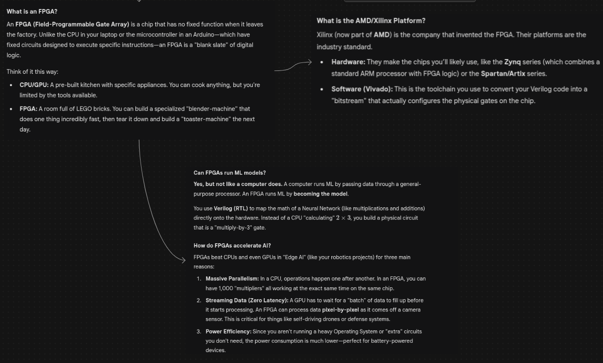
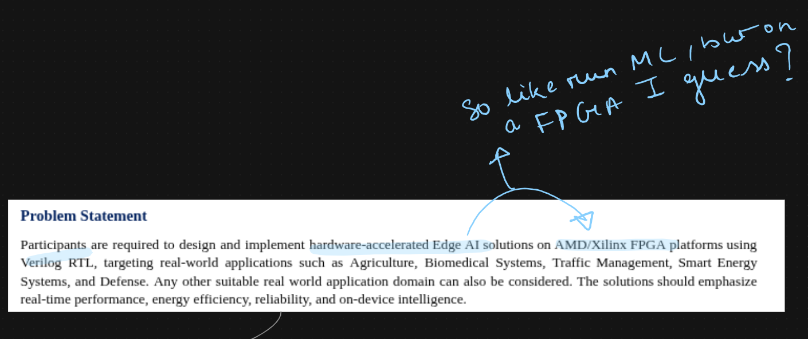

<h1 align="center">FPGA × ML</h1>

planning branch

absolute basics to work on and resources to help with it

 

  

  ⬇

  

 

  <b>current state:</b> planning + resource dump  
   
  <b>next:</b> coding branch with actual implementations

  <a href="prerequisite_resources/basic_resources.md">basic resources</a>

